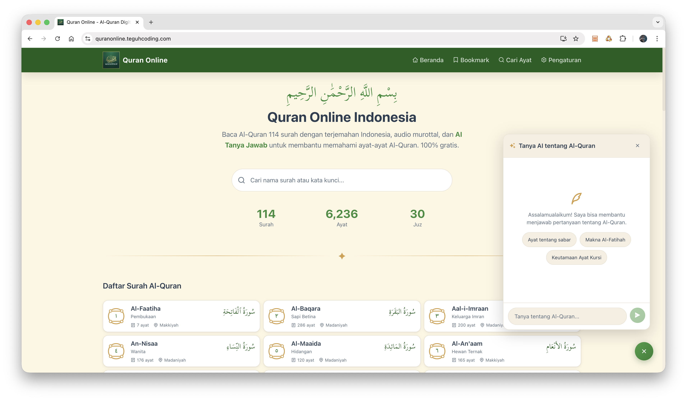

# Quran Online Indonesia

Aplikasi web **Al-Quran digital** dengan terjemahan Bahasa Indonesia, audio murottal, dan **AI Tanya Jawab** untuk membantu memahami ayat-ayat Al-Quran. Dibangun dengan Next.js 16 dan React 19.


**Demo:** [quranonline.teguhcoding.com](https://quranonline.teguhcoding.com)

## Fitur

| Fitur | Deskripsi |
|-------|-----------|
| **114 Surah** | Daftar lengkap surah dengan teks Arab (Uthmani) dan terjemahan Indonesia |
| **AI Tanya Jawab** | Chatbot berbasis AI untuk bertanya seputar Al-Quran (per surah atau umum) |
| **Audio Murottal** | Pemutaran audio per ayat dengan pilihan beberapa qari |
| **Pencarian** | Cari surah atau teks dalam terjemahan |
| **Bookmark** | Simpan ayat favorit (disimpan di browser) |
| **Export PDF** | Unduh surah atau ayat pilihan sebagai PDF |
| **Tema** | Mode terang, gelap, atau mengikuti sistem |
| **Tampilan** | Mode per-ayat atau per-surat (satu halaman) |
| **SEO & PWA** | Metadata, sitemap, JSON-LD, manifest; siap dipublikasi |

## Tech Stack

- **Framework:** Next.js 16 (App Router)
- **UI:** React 19, Tailwind CSS 4
- **Bahasa:** TypeScript
- **Data:** [Al-Quran Cloud API](https://alquran.cloud/api)
- **AI:** Vercel AI SDK (OpenAI / Google)
- **PDF:** jsPDF, html2canvas

## Persyaratan

- Node.js 18+
- npm / pnpm / yarn

## Instalasi & Menjalankan

```bash
# Clone (jika dari repo)
git clone <url-repo>
cd quran

# Install dependensi
npm install

# Variabel lingkungan (opsional, untuk AI chat)
# Buat file .env.local dan isi:
# OPENAI_API_KEY=sk-...   atau
# GOOGLE_GENERATIVE_AI_API_KEY=...

# Development
npm run dev
```

Buka [http://localhost:3000](http://localhost:3000).

```bash
# Build production
npm run build

# Jalankan production
npm start
```

## Struktur Proyek (Ringkas)

```
src/
├── app/                    # App Router
│   ├── page.tsx            # Home (daftar surah)
│   ├── surah/[number]/     # Halaman surah
│   ├── search/             # Pencarian
│   ├── bookmarks/          # Bookmark
│   ├── settings/           # Pengaturan
│   └── api/                # API routes (chat, search, surah)
├── components/             # Komponen React
├── hooks/                  # useTheme, useAudio, useReciter, useBookmarks
├── lib/                    # api, ai, generateSurahPDF, surah-translations
└── types/                  # TypeScript types
```

## Variabel Lingkungan

| Variabel | Wajib | Keterangan |
|----------|--------|------------|
| `NEXT_PUBLIC_APP_URL` | Tidak | URL publik (default: https://quranonline.id), untuk SEO & canonical |
| `OPENAI_API_KEY` | Untuk AI | API key OpenAI (jika pakai model OpenAI) |
| `GOOGLE_GENERATIVE_AI_API_KEY` | Untuk AI | API key Google AI (jika pakai model Gemini) |

Tanpa API key AI, fitur **AI Tanya Jawab** tidak akan berfungsi; fitur lain tetap jalan.

## Lisensi & Kredit

- Data ayat & terjemahan: [Al-Quran Cloud API](https://alquran.cloud/api)
- Font Arab: Scheherazade New, Amiri (Google Fonts)
- Dibuat oleh [Teguh Widodo](https://www.linkedin.com/in/teguhwin8/)

---

**Quran Online Indonesia** — Baca Al-Quran online dengan terjemahan Indonesia dan AI Tanya Jawab. 100% gratis.
